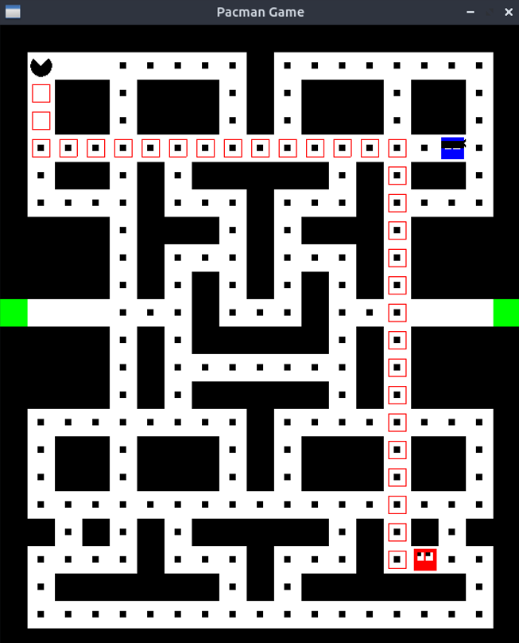
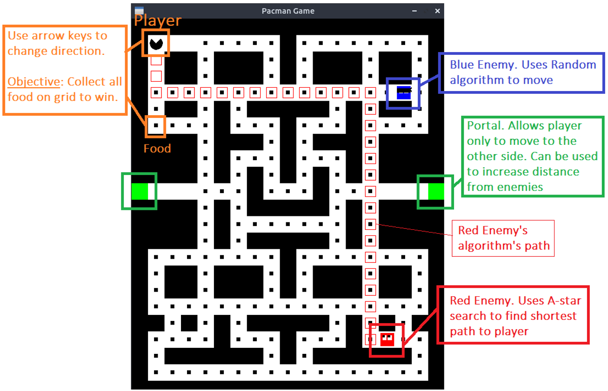

# Pacman Game
This project describes a 2D game similar to the original Pacman game. The game is programmed in C++ and the 2D graphics are rendered using SDL2 library.

## Dependencies for Running Locally
* cmake >= 3.7
  * All OSes: [click here for installation instructions](https://cmake.org/install/)

* make >= 4.1 (Linux, Mac), 3.81 (Windows)
  * Linux: make is installed by default on most Linux distros
  * Mac: [install Xcode command line tools to get make](https://developer.apple.com/xcode/features/)
  * Windows: [Click here for installation instructions](http://gnuwin32.sourceforge.net/packages/make.htm)

* SDL2 >= 2.0
  * All installation instructions can be found [here](https://wiki.libsdl.org/Installation)
  * Note that for Linux, an `apt` or `apt-get` installation is preferred to building from source.
  
* gcc/g++ >= 5.4
  * Linux: gcc / g++ is installed by default on most Linux distros
  * Mac: same deal as make - [install Xcode command line tools](https://developer.apple.com/xcode/features/)
  * Windows: recommend using [MinGW](http://www.mingw.org/)

## Basic Build Instructions
* Make a build directory in the top level directory: `mkdir build && cd build`
* Compile: `cmake .. && make`
* Run it: `./PacmanGame`.

## How to play
### Player Objective
* Use arrow keys to change player direction
* Collect all food on the grid
* Use green portals to quickly change to the other side (portals allow only the player)
* Avoid running into enemies

### Enemy AI behaviour
There are two enemies in the game, red and blue.
* Red Enemy (Predictable movement): Uses A* search algorithm to find the shortest path to the player and moves along that path.
* Blue Enemy (Unpredictable movement): Uses a random algorithm to select next move.

